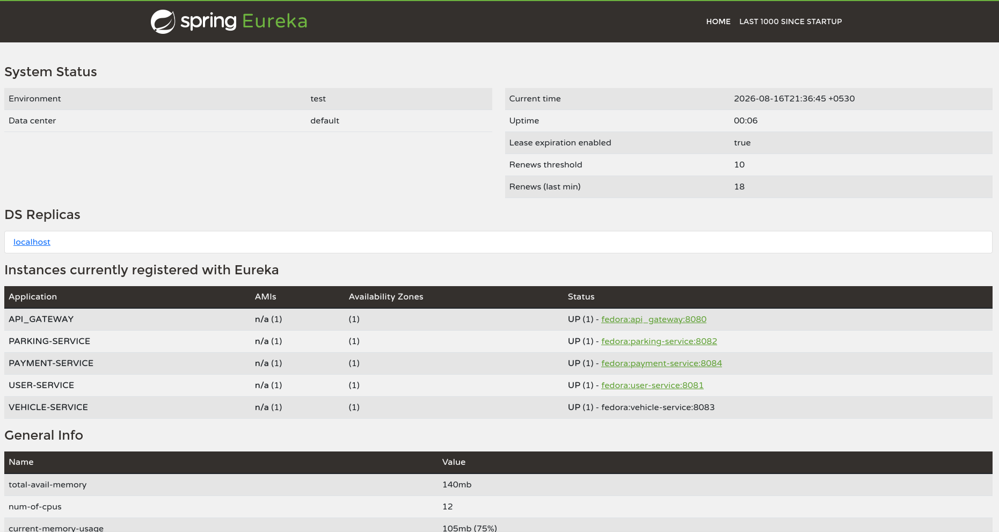

# ParkFlow — Smart Parking Management System

A cloud-native, microservice-based platform for real-time parking space discovery, reservation, and payment — built for **ITS 1018: Software Architectures & Design Patterns II** (Graduate Diploma in Software Engineering, IJSE).

ParkFlow lets drivers find and reserve parking spaces, links vehicles to registered users, and processes mock card payments with digital receipts — all through an API Gateway backed by service discovery and centralized configuration.

## Resources

- [Postman Collection](./postman_collection.json)
- 

## Architecture

All client traffic enters through the **API Gateway**, which routes to the appropriate microservice using **Eureka** for service discovery. Each Spring Boot service pulls its configuration from the **Config Server** at startup.

```
                         ┌─────────────────────┐
                         │   API Gateway :8080  │
                         └──────────┬───────────┘
                                    │
        ┌───────────────┬──────────┼──────────┬───────────────┐
        │                │                     │               │
┌───────▼──────┐ ┌───────▼──────┐   ┌──────────▼─────┐ ┌───────▼───────┐
│Parking Service│ │ User Service │   │ Vehicle Service │ │Payment Service│
│    :8082      │ │    :8081     │   │      :8083      │ │     :8084     │
│  Spring Boot   │ │ Spring Boot  │   │ Express + TS +  │ │ Spring Boot   │
│    + MySQL     │ │   + MySQL    │   │    MongoDB      │ │   + MySQL     │
└────────────────┘ └──────────────┘   └──────────────────┘ └───────────────┘
        │                │                     │               │
        └────────────────┴──────────┬──────────┴───────────────┘
                                     │
                       ┌─────────────▼─────────────┐
                       │  Eureka Server      :8761   │
                       │  Config Server      :8888   │
                       └──────────────────────────────┘
```

- **Service Registry (Eureka):** every microservice registers itself on startup, so the Gateway and Payment Service can discover each other by name (`lb://parking-service`, `lb://user-service`, etc.) instead of hardcoded hosts.
- **Config Server:** parking, user, and payment services fetch their port, context path, and datasource settings from a shared native config repo at boot, so config changes don't require redeploying a service.
- **API Gateway:** the single entry point for every request. Routes are matched by path prefix and forwarded to the correct service through Eureka's load balancer.
- **Payment Service → cross-service validation:** before recording a payment, it calls the User, Parking, and Vehicle services directly to confirm the referenced IDs actually exist, so a payment can never be created against a non-existent user, parking spot, or vehicle.

## Microservices

| Service | Tech Stack | Port | Responsibility |
|---|---|---|---|
| **Parking Service** | Spring Boot 4 (Java 21), MySQL | 8082 | Register/update/delete parking spaces, filter by city/zone/location, reserve & release slots, auto-track availability status (`AVAILABLE` / `FULL` / `CLOSED`) |
| **User Service** | Spring Boot 4 (Java 21), MySQL | 8081 | Register drivers/owners/admins, login, profile updates, duplicate-email protection |
| **Vehicle Service** | Express 5 + TypeScript, MongoDB (Mongoose) | 8083 | Register vehicles linked to a user, record entry/exit status, prevent duplicate plate numbers |
| **Payment Service** | Spring Boot 4 (Java 21), MySQL | 8084 | Validate mock card details, process payments (success/decline simulation), generate digital receipts, payment history by user |
| **API Gateway** | Spring Cloud Gateway | 8080 | Single entry point, routes requests to services via Eureka |
| **Eureka Server** | Spring Cloud Netflix Eureka | 8761 | Service registry & discovery |
| **Config Server** | Spring Cloud Config | 8888 | Centralized configuration for Parking, User, and Payment services |

## API Routes (via Gateway)

| Service | Base Path |
|---|---|
| Parking | `/parking_service/api/v1/parking` |
| User | `/user_service/api/v1/users` |
| Vehicle | `/api/v1/vehicles` |
| Payment | `/payment_service/api/v1/payments` |

Full endpoint-by-endpoint behavior — including validation rules, error codes, and chained end-to-end flows — is covered in the Postman collection linked above.

## Running Locally

Start the services in this order so registration and config-loading succeed cleanly:

1. **Eureka Server** (`:8761`)
2. **Config Server** (`:8888`)
3. **Parking Service**, **User Service**, **Payment Service** (Spring Boot — pull config from Config Server, register with Eureka)
4. **Vehicle Service** (Express/TypeScript — connects to MongoDB, registers with Eureka independently)
5. **API Gateway** (`:8080`)

Once every service shows as `UP` on the Eureka dashboard (`http://localhost:8761`), the system is ready and all requests can be sent through the Gateway at `http://localhost:8080`.

### Vehicle Service environment variables

```
PORT=8083
MONGO_URI=mongodb://localhost:27017/vehicle_service_parkflow
EUREKA_HOST=localhost
EUREKA_PORT=8761
```

## Testing

All endpoints are tested end-to-end through the API Gateway using the attached Postman collection. The collection:

- Chains a full user journey: create a Parking spot → register a User → register that User's Vehicle → pay for the Vehicle's Parking session.
- Covers success paths, validation failures (400), not-found cases (404), duplicate/conflict cases (409), and unauthorized login attempts (401).
- Ends with a Cleanup folder that deletes all created test data and verifies deletion, so the collection can be re-run from a clean state.

## Project Structure

```
ParkFlow---smart-parking-management-system/
├── api_gateway/
├── config_server/
├── eureka_server/
├── parking_service/
├── user_service/
├── vehicle_service/
├── payment_service/
├── docs/
│   └── screenshots/
│       └── eureka_dashboard.png
├── postman_collection.json
└── README.md
```
